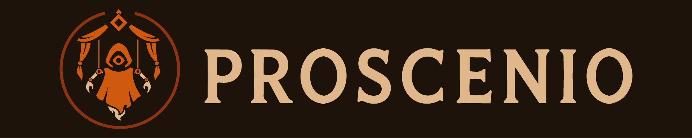
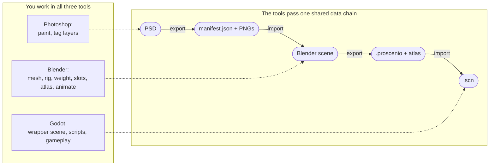

# Proscenio

**A Photoshop → Blender → Godot pipeline for 2D cutout animation.**

> [!WARNING]
> Proof of concept, work in progress. The format is still unstable - not for production use.

## What it is

Proscenio is an open-source pipeline for 2D cutout animation. You paint in Photoshop, rig and animate in Blender, and ship to Godot.

It is an artist-friendly alternative to Spine and similar tools, with no custom runtime and no proprietary editor.

Proscenio is part of the [Firebound](https://github.com/firebound/firebound) project, but works as a standalone toolset.

## How it works

You work in all three tools, and each hands the next a single file. The diagram separates the work you do (top) from the data chain the tools pass between them (bottom):

### Independent tools

What binds the pipeline is the **format**, not the tools - nothing necessary is locked to Adobe, Blender, or Godot. A future Krita or GIMP exporter, or a Unity importer that reads a `.proscenio`, plugs in with no change to the other ends.

Each step is idempotent, so re-export and re-import are safe to repeat.

What keeps the format trustworthy is a **single data model as the source of truth**: schemas written as [pydantic](https://docs.pydantic.dev/latest/) models, with a codegen step that generates the JSON Schema, the TypeScript types, and the Godot resources from them. Both ends read and write typed, so no loose dictionary drifts apart at the edges.

## Why

- **Non-destructive.** Each plugin is independent and leaves the others' work alone: your source `.psd` and `.blend` stay read-only, and a Godot reimport overwrites only the generated scene, never your wrapper scene, scripts, or gameplay. Inside each tool, the operations are built to preserve your work rather than overwrite it.

- **Engine-native output.** The export builds from the target engine's own nodes - in Godot, a plain `Skeleton2D` + `Bone2D` + `Polygon2D` + `AnimationPlayer` scene. The shipped game runs with Proscenio uninstalled.

## Who it's for

Artists and game devs who want a practical 2D cutout workflow. You will need:

- **Photoshop 2024+**
- **Blender 4.2+**
- **Godot 4.6+**

## Components

| Part | Tech | Role |
| --- | --- | --- |
| [`apps/photoshop/`](apps/photoshop/) | UXP plugin (TypeScript + React) | PSD → manifest + per-layer PNGs. |
| [`apps/blender/`](apps/blender/) | Python addon | Import, the authoring panel, validation, and the `.proscenio` writer. |
| [`apps/godot/`](apps/godot/) | GDScript | Rebuilds the scene from a `.proscenio` on every reimport. |
| [`packages/models/`](packages/models/) | Pydantic v2 | The schema models that the other ends are generated from. |

## Not in scope

Paradigm non-goals, whichever tools join the chain:

- **A custom runtime shipped with the game** (the Spine / DragonBones model). Each engine target gets a native scene instead, so a new engine means a new exporter, not a runtime to bundle.

- **Live2D-style parameter deformers.** Skeleton-based cutout, not parameter-blended mesh deformation.

## Learn more

- **[Documentation site](https://firebound.github.io/proscenio/)**:
  - [Basic walkthrough](https://firebound.github.io/proscenio/guides/basic) - the whole loop, end to end.
  - [Architecture](https://firebound.github.io/proscenio/project/architecture) - the systems and how the data flows.
  - [Comparison](https://firebound.github.io/proscenio/project/comparison) - feature matrix vs Spine, COA Tools 2, Live2D, and others.
- **[`CONTRIBUTING.md`](CONTRIBUTING.md)** - how to build, test, and contribute.
- **[`AGENTS.md`](AGENTS.md)** and [`.ai/`](.ai/README.md) - project structure and conventions.

> [!NOTE]
> All code and docs are human-reviewed, but as a solo dev in the early stages, I can't rule out every AI artifact.

  

## License

GPL-3.0-or-later. See [LICENSE](LICENSE).
