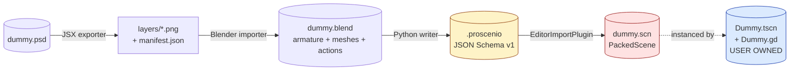
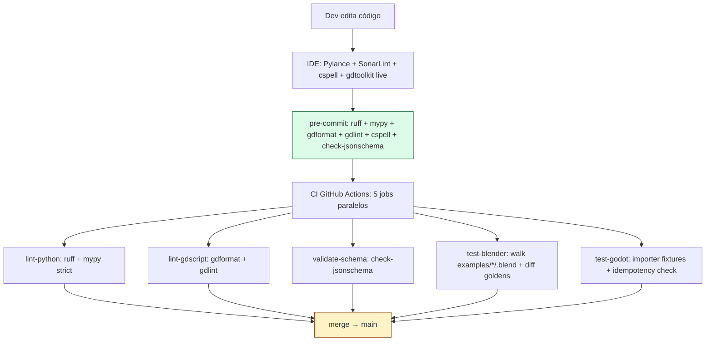
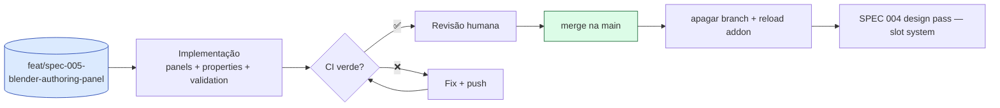
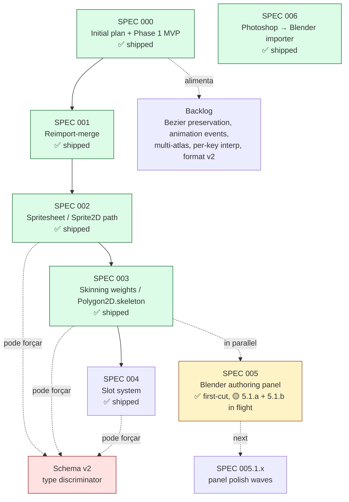
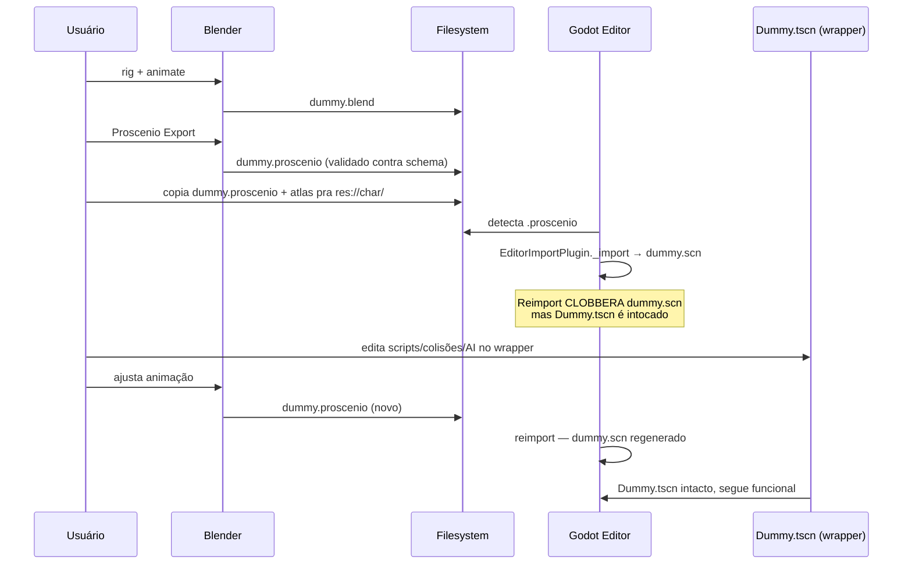

# Proscenio — Status

Snapshot vivo. Para detalhes profundos veja `specs/`, `.ai/conventions.md`, `AGENTS.md`.

## O que é

Pipeline **Photoshop → Blender → Godot 4** para 2D cutout animation. Substitui o gap deixado por COA Tools (Godot side morto desde 2.x) e Spine2D (pago, GDExtension obrigatória). O contrato entre componentes é um **único arquivo JSON versionado** (`.proscenio`); o output final do plugin Godot são **cenas nativas** (`Skeleton2D` + `Bone2D` + `Polygon2D` + `AnimationPlayer`) que rodam em qualquer Godot 4 sem o plugin instalado.

## Arquitetura

**Direção de dependência estrita**: Photoshop não conhece Blender; Blender não conhece Godot internals; Godot conhece só `.proscenio`. Mudanças no schema forçam multi-component PR + bump de `format_version`.

### Componentes

| Path | Linguagem | Papel | Estado |
| --- | --- | --- | --- |
| `photoshop-exporter/` | ExtendScript (`.jsx`) + JSDoc + `@ts-check` | Exporta layers visíveis como PNGs + manifest JSON | scaffold funcional, sem CI (Photoshop sem headless) |
| `blender-addon/` | Python 3.11, mypy strict | Lê armature + sprite meshes + actions, emite `.proscenio` schema-válido | writer real, operator no painel sidebar, golden-fixture test em CI |
| `godot-plugin/` | GDScript 2.0 typed | `EditorImportPlugin` que parseia `.proscenio` e gera `.scn` | importer + 3 builders (skeleton/polygon/animation), idempotency test |
| `schemas/` | JSON Schema 2020-12 | Contrato compartilhado, source of truth | `format_version=1`, validado em 3 pontos |
| `examples/dummy/` | mix | Fixture canônica + worked-example wrapper | `.proscenio` hand-written + `.blend` minimal + `.tscn` wrapper |

### O doll fixture — três artefatos, três papéis

| Arquivo | Quem escreve | Sobrevive reimport? |
| --- | --- | --- |
| `doll.proscenio` | Blender / DCC — source of truth | rewritten pelo exporter |
| `doll.scn` (gerado) | Godot importer regenera do `.proscenio` | **clobbered** todo reimport |
| `Doll.tscn` + `Doll.gd` | usuário — wrapper scene | **intacto** sempre |

`Doll.tscn` instancia `doll.scn`. Scripts/colisões/AI/extra nodes ficam no wrapper, não na imported scene. Esta é a resolução da **SPEC 001 Option A** — full overwrite + wrapper pattern.

### Decisões arquiteturais trancadas

| Decisão | Razão |
| --- | --- |
| **No GDExtension, no native runtime** | Plugin é GDScript-only. Generated scenes são native nodes — funcionam com plugin desinstalado. Spine quebra essa rule, Proscenio não. |
| **Conversão one-time, no editor** | Tudo o trabalho pesado acontece em import-time. Runtime usa só Godot core (já em C++). Sem performance ceiling do GDScript. |
| **Tipagem forte everywhere** | GDScript 2.0 com `untyped_declaration=2` (error) + Python mypy `--strict` + ExtendScript `@ts-check` + JSDoc. Erros pegos antes de runtime. |
| **Schema é contrato** | Mudança na shape do `.proscenio` exige bump de `format_version` + migrator. CI valida fixtures. |
| **One component per PR** | Exceto schema bump (que cruza componentes por design). |
| **Branch policy**: SPEC docs direto na `main`, implementação em `feat/spec-<NNN>-<slug>` (Conventional Commits prefix) com PR | SPEC docs informam paralelos; implementação fica isolada. Prefixos seguem padrão CC: `feat/`, `fix/`, `chore/`, etc. |
| **C# / GDExtension como escape hatch documentado** | Não é opção atual. Triggers concretos (deep Firebound integration, perf ceiling, live link) listados em `specs/backlog.md` "Architecture revisits". |

## Validação em camadas

**Cinco gates.** Quanto mais cedo o erro pega, mais barato é. Schema validado em 3 pontos: writer output (test runner roda check-jsonschema in-process), importer input (`format_version` guard + per-field `push_error`), CI fixtures.

## O que já foi entregue (Phase 1 MVP)

- ✅ Schema v1 (`format_version=1`) com `Bone`, `Sprite`, `Animation`, `bone_transform` track, `weights` array (aceito mas ignorado pelo importer v1)
- ✅ Writer Blender que cobre Blender 5.x layered actions API (`action.layers[].strips[].channelbags[].fcurves`) com fallback para legacy `action.fcurves`
- ✅ Coordenada conversion Blender XZ → Godot XY (Y-flip + CCW→CW rotation), rest+delta absolute values nas tracks
- ✅ Importer Godot com `EditorImportPlugin._import` → builders → `PackedScene.pack` → `ResourceSaver.save`
- ✅ Animation com `INTERPOLATION_CUBIC_ANGLE` em rotation (handles wrap-around ±π) + `INTERPOLATION_CUBIC` em position/scale
- ✅ Atlas texture mapeado em pixel-space (`Polygon2D.uv` recebe `uv * atlas.get_size()`)
- ✅ Plugin-uninstall test verificado manualmente (regra no-GDExtension)
- ✅ JSX exporter scaffold (layer walk recursivo + PNG export + JSON manifest)
- ✅ CI: ruff + mypy strict + gdformat + gdlint + check-jsonschema + test-blender headless + test-godot headless
- ✅ pre-commit hooks unificados (`ruff`, `mypy`, `gdformat`, `gdlint`, `cspell`, `check-jsonschema`)
- ✅ Convenções documentadas (`.ai/conventions.md`, `AGENTS.md`)
- ✅ LICENSE GPL-3.0 inline, maintainer email + repo URL canônicos

### Estado atual em números

| Métrica | Valor |
| --- | --- |
| GDScript LOC (plugin) | ~340 linhas, 100% typed |
| Python LOC (addon) | ~470 linhas, mypy `--strict` clean |
| Test assertions Godot | 31 (dummy 10 + effect 12 + skinned 9, incluindo idempotency) |
| Test assertions Python | 46 (validation 12 + properties 6 + region 7 + mirror 5 + atlas_packer 8 + uv_bounds 8) |
| Test fixtures Blender | 5 golden diffs auto-walked pelo `run_tests.py` (`examples/doll`, `examples/blink_eyes`, `examples/shared_atlas`, `examples/simple_psd`, `examples/slot_cycle`). Legacy `examples/dummy/` + `examples/effect/` retired (Type B importer-only fixtures under `godot-plugin/tests/fixtures/` mantidas) |
| CI jobs | 5 (lint-python agora roda pytest também) |
| SPECs escritos | 7 shipped (000, 001, 002, 003, 004, 005, 006), 1 design-only (007) |

## O que está em andamento

SPEC 006 (Photoshop → Blender importer) entregue end-to-end. Waves 6.0 + 6.0.5 + 6.1 + 6.2 + 6.3 + 6.4 já merged (PRs #16–#20 + lint cleanup #21). Wave 6.5 (`examples/simple_psd/`) em PR aberta #22 — fixture com manifest 256x128 (1 polygon + 1 sprite_frame de 4 frames) driving o importer headless pra produzir `.blend` + golden `.proscenio`. Roundtrip integration: bpy → SPEC 006 v1 manifest → JSX importer → PSD real → JSX exporter → manifest mirror, mais o addon operator `Import Photoshop Manifest` que cria planes + stub armature.

SPEC 005.1.d.1 (driver shortcut) + 5.1.d.5 (status badges + help popups) shipped (PR #23). Driver shortcut cobre gradual parameter mapping; hard texture swap (forearm front/back) caiu pra SPEC 004.

SPEC 004 (slot system) entregue end-to-end. Waves 4.1 (writer + panel + preview shader, PR #25) + 4.2 (Godot importer + slot_attachment track, PR #26) + 4.3 (slot_cycle fixture + writer track emission + drive-bys) merged. Schema sem bump (`slots[]` + `slot_attachment` track já em `format_version=1`). Doll brow promotion deferida pra wave futura -- `examples/slot_cycle/` já cobre o slot system end-to-end.

> **Nota de convenção**: branches recentes (`spec/001-…`, `spec/002-…`, `spec/003-…`) precedem a regra atualizada de Conventional Commits. Próximas branches usam `feat/spec-NNN-<slug>`.

## Roadmap

### Detalhamento

| SPEC | O que entrega | Quando |
| --- | --- | --- |
| **000** | Phase 1 MVP completo | shipped |
| **001** | Wrapper-scene pattern, importer log na regenerate, idempotency test | shipped |
| **002** | `Sprite2D` + `sprite_frame` track type, discriminador `type` aditivo, fixture `examples/effect/` | shipped |
| **003** | `Polygon2D.skeleton` wiring + per-vertex bone weights — deformação real de mesh, não rigid attach | shipped |
| **004** | Slot system — sprite-swap groups (`slot_attachment` track) para equipamento/expressões + hard texture swap (forearm front/back). Empty Object como slot anchor + child meshes como attachments; Godot importer gera `Node2D` parent + `visible`-toggled children. Sem schema bump (`slots[]` já em v1). Fixture `examples/slot_cycle/` cobre o sistema end-to-end. | shipped (Waves 4.1 PR #25 + 4.2 PR #26 + 4.3 fixtures + writer slot_attachment track) |
| **005** | Blender authoring panel — sidebar com sprite type dropdown, sprite_frame metadata, sticky export, validation inline + lazy. PropertyGroup é canônica; raw Custom Property é fallback de leitura. Inspirada no painel COA Tools. | first-cut + 5.1.a + 5.1.b shipped (PRs #4–#7); 5.1.c.1 (region authoring) PR #8; fix bundle PR #9; **5.1.c.2 (atlas packer)** branch atual; 5.1.d (advanced) onda seguinte — ver [RESEARCH](specs/005-blender-authoring-panel/RESEARCH.md) |
| **006** | Photoshop → Blender importer — JSON manifest v1 contract (schema 2020-12 com `kind` discriminator), JSX importer que monta PSD a partir do manifest, JSX exporter que emite o manifest mirror, addon `Import Photoshop Manifest` operator que cria planes + stub armature. Fixture `examples/simple_psd/` cobre roundtrip end-to-end. | Waves 6.0 + 6.0.5 + 6.1 + 6.2 + 6.3 + 6.4 shipped (PRs #16–#20 + lint #21); Wave 6.5 (fixture) em PR #22 aguardando merge |

### Backlog (sem ordem)

| Item | Onde |
| --- | --- |
| Bezier curve preservation no schema | format v2 |
| Animation events / method tracks (sound cues, particles) | format extension |
| Múltiplos atlases por personagem | format v2 |
| Per-key interpolation mixing | format v2 |
| CI matrix (Blender 4.2 LTS + Godot 4.3) | `ci/matrix-expansion` |
| Plugin-uninstall test em CI | `ci/uninstall-test` |
| `scripts/install-dev.ps1` automação dev junctions | `chore/install-dev` |
| GDExtension / C# escape hatch | `specs/backlog.md` "Architecture revisits" — **só** com triggers concretos |

## Próximo passo

SPEC 004 entregue end-to-end (Waves 4.1 PR #25 + 4.2 PR #26 + 4.3 atual com slot_cycle fixture, drive-by waist VG re-fix, writer slot_attachment track emission). 5/5 fixtures Type A em CI (`doll`, `blink_eyes`, `shared_atlas`, `simple_psd`, `slot_cycle`). Cutout primitives shipped: polygon, sprite_frame, slots. Falta SPEC 008 (UV animation) pra fechar o trio gradual+discrete+region.

1. **SPEC 008 (UV animation)** — `texture_region` track type para iris-scroll / hframes-cycling animados. Design já rascunhado em `specs/008-uv-animation/STUDY.md`. Fecha o cutout playbook: gradual region (008) + hard swap (004) + frame index (002) + driver shortcut (5.1.d.1) cobrem todos os casos de animação 2D.
2. **Doll brow promotion** (deferida de Wave 4.3) — `examples/doll/brow.L/R` viram slots com brow-up/down attachments. Showcase de slots no fixture comprehensive.
3. **SPEC 005.1.d.2/.3/.4** advanced wave (pose library shim, quick armature, spriteobject custom outliner) — opcional, polish.
4. **`README.md` Quickstart** — mencionar `Import Photoshop Manifest` + `Create Slot` operators + skills docs pendentes.
5. **Manual validation aberto na SPEC 003** continua user-driven (paint weights, observar deformação, plugin-uninstall test).

---

## Apêndice — fluxo dev iteration

