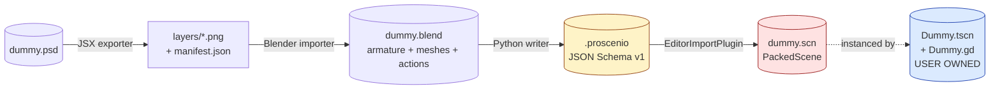
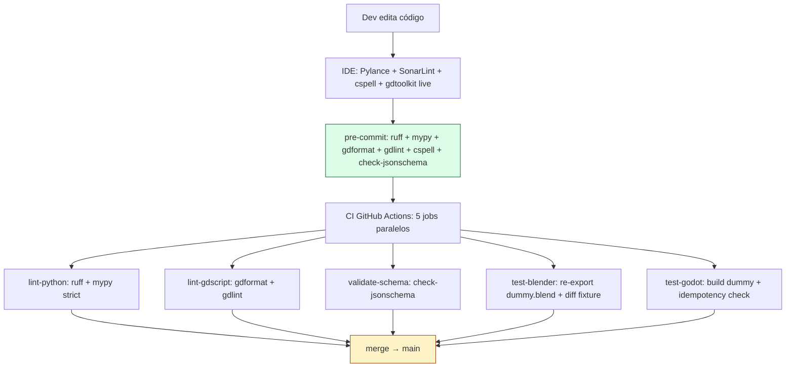
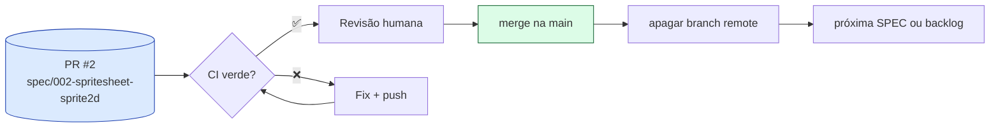
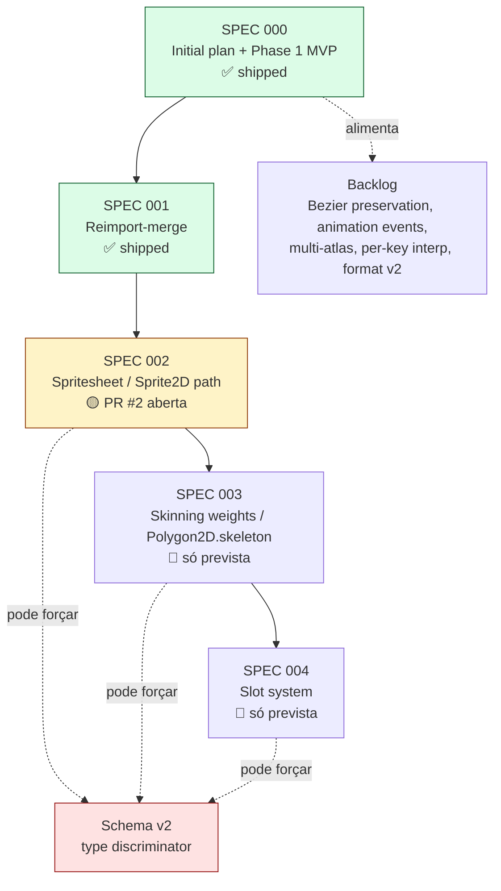
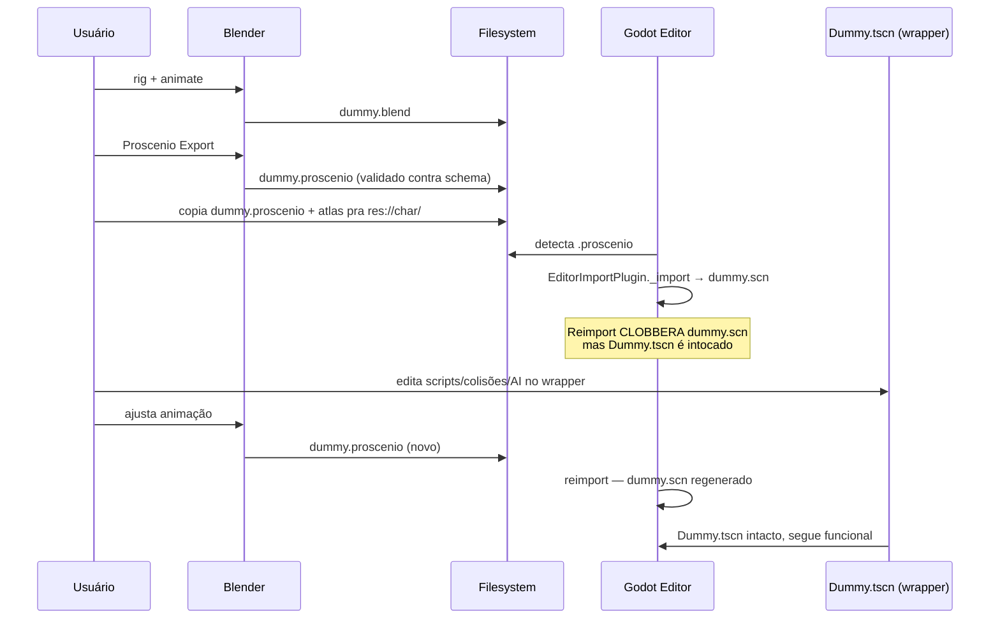

# Proscenio — Status

Snapshot vivo. Para detalhes profundos veja `specs/`, `.ai/conventions.md`, `AGENTS.md`.

## O que é

Pipeline **Photoshop → Blender → Godot 4** para 2D cutout animation. Substitui o gap deixado por COA Tools (Godot side morto desde 2.x) e Spine2D (pago, GDExtension obrigatória). O contrato entre componentes é um **único arquivo JSON versionado** (`.proscenio`); o output final do plugin Godot são **cenas nativas** (`Skeleton2D` + `Bone2D` + `Polygon2D` + `AnimationPlayer`) que rodam em qualquer Godot 4 sem o plugin instalado.

## Arquitetura

**Direção de dependência estrita**: Photoshop não conhece Blender; Blender não conhece Godot internals; Godot conhece só `.proscenio`. Mudanças no schema forçam multi-component PR + bump de `format_version`.

### Componentes

| Path | Linguagem | Papel | Estado |
| --- | --- | --- | --- |
| `photoshop-exporter/` | ExtendScript (`.jsx`) + JSDoc + `@ts-check` | Exporta layers visíveis como PNGs + manifest JSON | scaffold funcional, sem CI (Photoshop sem headless) |
| `blender-addon/` | Python 3.11, mypy strict | Lê armature + sprite meshes + actions, emite `.proscenio` schema-válido | writer real, operator no painel sidebar, golden-fixture test em CI |
| `godot-plugin/` | GDScript 2.0 typed | `EditorImportPlugin` que parseia `.proscenio` e gera `.scn` | importer + 3 builders (skeleton/polygon/animation), idempotency test |
| `schemas/` | JSON Schema 2020-12 | Contrato compartilhado, source of truth | `format_version=1`, validado em 3 pontos |
| `examples/dummy/` | mix | Fixture canônica + worked-example wrapper | `.proscenio` hand-written + `.blend` minimal + `.tscn` wrapper |

### O dummy fixture — três artefatos, três papéis

| Arquivo | Quem escreve | Sobrevive reimport? |
| --- | --- | --- |
| `dummy.proscenio` | Blender / DCC — source of truth | rewritten pelo exporter |
| `dummy.scn` (gerado) | Godot importer regenera do `.proscenio` | **clobbered** todo reimport |
| `Dummy.tscn` + `Dummy.gd` | usuário — wrapper scene | **intacto** sempre |

`Dummy.tscn` instancia `dummy.scn`. Scripts/colisões/AI/extra nodes ficam no wrapper, não na imported scene. Esta é a resolução da **SPEC 001 Option A** — full overwrite + wrapper pattern.

### Decisões arquiteturais trancadas

| Decisão | Razão |
| --- | --- |
| **No GDExtension, no native runtime** | Plugin é GDScript-only. Generated scenes são native nodes — funcionam com plugin desinstalado. Spine quebra essa rule, Proscenio não. |
| **Conversão one-time, no editor** | Tudo o trabalho pesado acontece em import-time. Runtime usa só Godot core (já em C++). Sem performance ceiling do GDScript. |
| **Tipagem forte everywhere** | GDScript 2.0 com `untyped_declaration=2` (error) + Python mypy `--strict` + ExtendScript `@ts-check` + JSDoc. Erros pegos antes de runtime. |
| **Schema é contrato** | Mudança na shape do `.proscenio` exige bump de `format_version` + migrator. CI valida fixtures. |
| **One component per PR** | Exceto schema bump (que cruza componentes por design). |
| **Branch policy**: SPEC docs direto na `main`, implementação em `spec/<NNN>-<slug>` com PR | SPEC docs informam paralelos; implementação fica isolada. |
| **C# / GDExtension como escape hatch documentado** | Não é opção atual. Triggers concretos (deep Firebound integration, perf ceiling, live link) listados em `specs/backlog.md` "Architecture revisits". |

## Validação em camadas

**Cinco gates.** Quanto mais cedo o erro pega, mais barato é. Schema validado em 3 pontos: writer output (test runner roda check-jsonschema in-process), importer input (`format_version` guard + per-field `push_error`), CI fixtures.

## O que já foi entregue (Phase 1 MVP)

- ✅ Schema v1 (`format_version=1`) com `Bone`, `Sprite`, `Animation`, `bone_transform` track, `weights` array (aceito mas ignorado pelo importer v1)
- ✅ Writer Blender que cobre Blender 5.x layered actions API (`action.layers[].strips[].channelbags[].fcurves`) com fallback para legacy `action.fcurves`
- ✅ Coordenada conversion Blender XZ → Godot XY (Y-flip + CCW→CW rotation), rest+delta absolute values nas tracks
- ✅ Importer Godot com `EditorImportPlugin._import` → builders → `PackedScene.pack` → `ResourceSaver.save`
- ✅ Animation com `INTERPOLATION_CUBIC_ANGLE` em rotation (handles wrap-around ±π) + `INTERPOLATION_CUBIC` em position/scale
- ✅ Atlas texture mapeado em pixel-space (`Polygon2D.uv` recebe `uv * atlas.get_size()`)
- ✅ Plugin-uninstall test verificado manualmente (regra no-GDExtension)
- ✅ JSX exporter scaffold (layer walk recursivo + PNG export + JSON manifest)
- ✅ CI: ruff + mypy strict + gdformat + gdlint + check-jsonschema + test-blender headless + test-godot headless
- ✅ pre-commit hooks unificados (`ruff`, `mypy`, `gdformat`, `gdlint`, `cspell`, `check-jsonschema`)
- ✅ Convenções documentadas (`.ai/conventions.md`, `AGENTS.md`)
- ✅ LICENSE GPL-3.0 inline, maintainer email + repo URL canônicos

### Estado atual em números

| Métrica | Valor |
| --- | --- |
| GDScript LOC (plugin) | ~340 linhas, 100% typed |
| Python LOC (addon) | ~470 linhas, mypy `--strict` clean |
| Test assertions Godot | 22 (dummy 10 + effect 12, incluindo idempotency) |
| Test fixtures Blender | 1 golden diff (`dummy/expected.proscenio`) — `effect.blend` deferred |
| CI jobs | 5 |
| SPECs escritos | 2 fechadas (000, 002), 1 em revisão (001), 2 só previstas (003, 004) |

## O que está em andamento

**PR #2 — `spec/002-spritesheet-sprite2d`** → main. SPEC 002 entrega o caminho `Sprite2D` (spritesheet animation) ao lado do `Polygon2D` (cutout) via discriminador `type` por sprite, retro-compatível com fixtures v1.

PR #1 já está merged (SPEC 001 — wrapper-scene pattern).

7 commits SPEC 002 + arrumações (project.godot debug warnings, atlas mirror em `scripts/test_export.py`, regen do `expected.proscenio` pra refletir dummy mixto).

## Roadmap

### Detalhamento

| SPEC | O que entrega | Quando |
| --- | --- | --- |
| **000** | Phase 1 MVP completo | shipped |
| **001** | Wrapper-scene pattern, importer log na regenerate, idempotency test | shipped |
| **002** | `Sprite2D` + `sprite_frame` track type, discriminador `type` aditivo, fixture `examples/effect/` | **PR #2 em revisão** |
| **003** | `Polygon2D.skeleton` wiring + per-vertex bone weights — deformação real de mesh, não rigid attach | depende de 002 só se schema v2 lançar antes |
| **004** | Slot system — sprite-swap groups (`slot_attachment` track) para equipamento/expressões | independente |

### Backlog (sem ordem)

| Item | Onde |
| --- | --- |
| Bezier curve preservation no schema | format v2 |
| Animation events / method tracks (sound cues, particles) | format extension |
| Múltiplos atlases por personagem | format v2 |
| Per-key interpolation mixing | format v2 |
| CI matrix (Blender 4.2 LTS + Godot 4.3) | `ci/matrix-expansion` |
| Plugin-uninstall test em CI | `ci/uninstall-test` |
| `scripts/install-dev.ps1` automação dev junctions | `chore/install-dev` |
| GDExtension / C# escape hatch | `specs/backlog.md` "Architecture revisits" — **só** com triggers concretos |

## Próximo passo

1. **Aguardar CI verde** na PR #2 (`gh pr checks 2`).
2. **Revisar o diff** (https://github.com/Space-Wizard-Studios/firebound-proscenio/pull/2).
3. **Merge** para `main`.
4. **Deletar** branch `spec/002-spritesheet-sprite2d`.
5. **Decidir SPEC seguinte**: 003 (skinning weights — `Polygon2D.skeleton` + bone weights, destrava mesh deformável) ou 004 (slot system — independente, pode rodar paralelo).

---

## Apêndice — fluxo dev iteration

