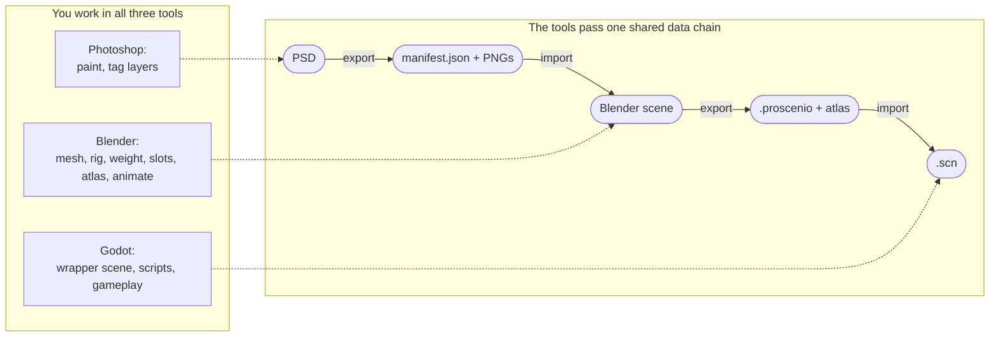

# Architecture

How Proscenio is built: the three plugins, the systems inside each, the data they move, and where the complexity and risk sit. Read this before changing anything load-bearing.

## The cross-app pipeline

You (the artist, or a team of game devs) work in all three tools - Photoshop, Blender, and Godot. Each tool hands the next one a file. The diagram separates the two things people tend to conflate: the **work you do** at each stage (top), and the **data chain the tools pass** between them (bottom).

### Independent tools, one shared language

Each plugin runs on its own: you can tag and export from Photoshop and never open Blender, hand-author a rig in Blender with no PSD, or consume a `.proscenio` in Godot whatever produced it.

What binds the pipeline is the **format**, not the tools - nothing is locked to Adobe, Blender, or Godot. A future Krita or GIMP exporter that emits a conforming manifest, or a Unity importer that reads a `.proscenio`, plugs in with no change to the other ends. The shared language is the product; the apps are interchangeable implementations of it.

Each step is idempotent, too: re-running it overwrites cleanly, so re-export and re-import are safe to repeat.

What makes that language trustworthy is a **single data model as the source of truth**: the schemas written as [pydantic](https://docs.pydantic.dev/latest/) models (`packages/models/`), and a codegen step (`packages/codegen/`) that generates the [JSON Schema](https://json-schema.org/), the [TypeScript](https://www.typescriptlang.org/) types, and the Godot [Resources](https://docs.godotengine.org/en/stable/classes/class_resource.html) from them. Change a field in one place and all three ends regenerate.

In practice, Blender **writes** the `.proscenio` file by building a typed pydantic object (`ProscenioDocument(...).model_dump_json()`), and Godot **reads** the same file as a typed Resource (`ProscenioDocument.from_dict(...)`) - neither end hand-maintains a loose dictionary.

## Photoshop - [UXP](https://developer.adobe.com/photoshop/uxp/2022/) plugin ([React](https://react.dev/) + [TypeScript](https://www.typescriptlang.org/))

Turns a layered PSD into a manifest plus PNGs that Blender can import.

The code is layered cleanly: an adapter isolates the Adobe API, the domain holds the pure (testable) logic, and the `io/` layer concentrates the side effects (reading and writing files, calling the Photoshop API) so the domain stays platform-free.

| System | What it does | Key files |
| --- | --- | --- |
| [**Document adapter**](../../apps/photoshop/src/adapters/photoshop-layer.ts) | Converts the Photoshop API's document and layers into its own `Layer` model. Acts as a boundary so the rest of the code never touches the Adobe API directly. | `adapters/photoshop-layer.ts` |
| [**Tag system**](../../apps/photoshop/src/domain/tag-parser.ts) | Reads and writes bracket markers in the layer name (`[ignore]`, `[merge]`, `[spritesheet]`, `[folder]`, `[scale]`, `[origin]`, and more). This is how the artist drives the export without leaving Photoshop. | `domain/tag-parser`, `tag-writer`, `tag-tree`; `io/layer-rename` |
| [**Planner**](../../apps/photoshop/src/domain/planner.ts) | The heart of the export: walks the layer tree and produces the manifest (each layer becomes a `polygon`, `mesh`, or `sprite_frame` entry), the list of PNGs to write, the warnings, and what was skipped. Resolves draw order (z-order), `[merge]` groups, automatic spritesheet detection, pivot, and scale. | `domain/planner.ts`, `domain/manifest.ts` |
| [**Manifest validation and I/O**](../../apps/photoshop/src/io/manifest-validator.ts) | Validates the manifest with [ajv](https://ajv.js.org/) (a runtime JSON Schema validator) **before** anything is written to disk, so an invalid manifest never reaches Blender. Plus the JSON reader and writer. | `io/manifest-validator` (ajv), `manifest-reader`, `manifest-writer` |
| [**PNG export**](../../apps/photoshop/src/io/png-writer.ts) | Renders each layer region to a PNG, reading the bounding box from the Photoshop selection. | `io/png-writer`, `png-placer`, `ps-selection`, `ps-selection-bounds` |
| [**Orchestration (export / import)**](../../apps/photoshop/src/controllers/export-flow.ts) | Wires it all together. Export: adapt the document, build the plan, validate, then write PNGs + manifest inside one Photoshop modal ([`executeAsModal`](https://developer.adobe.com/photoshop/uxp/2022/ps_reference/media/executeasmodal/)); the manifest is saved only if **every** PNG succeeded, so it never points at missing files. Import runs the reverse: from a manifest plus PNGs it **rebuilds a fresh PSD**. | `controllers/export-flow`, `import-flow` |
| [**UI and cross-cutting**](../../apps/photoshop/src/panels) | The panels (Exporter, Tags, Validate, Debug) with their sections and reactive hooks, plus supporting parts: [XMP](https://developer.adobe.com/xmp/docs/) metadata (so pixels-per-unit survives the round trip), a persistent output folder, and migration of old manifests (v1 to v2). | `panels/**`, `hooks/**`, `io/xmp`, `folder-storage`, `*/legacy-migration` |

## Blender - Python addon

The addon registers three groups: `properties`, `operators`, and `panels`.

**Before the systems, the data store.** Each object carries a `ProscenioObjectProps` (reached as `Object.proscenio`) and the scene carries a `ProscenioSceneProps`. These are [*PropertyGroups*](https://docs.blender.org/api/current/bpy.types.PropertyGroup.html) - Blender's typed structure for storing data on objects. Each field is also mirrored to a raw [*Custom Property*](https://docs.blender.org/manual/en/latest/files/custom_properties.html) (a loose key/value on the object), because the Custom Property is more resilient: it survives the addon being disabled and is a stable target for animation drivers. The mirroring is done by `hydrate` / `cp_keys` / `pg_cp_fallback`.

| System | What it does | Operators / core |
| --- | --- | --- |
| [**Automesh**](../../apps/blender/core/automesh) | Builds the sprite's mesh from the image alpha: it detects the silhouette, then triangulates the interior with [CDT](https://en.wikipedia.org/wiki/Constrained_Delaunay_triangulation) (constrained Delaunay triangulation - a triangle mesh that respects the outline). It has an interactive authoring mode (a modal) with a GPU overlay where the artist edits the contour, adds points, and cuts. The geometry logic is **pure** (`core/automesh`, no Blender) and kept separate from the bridge that touches [bmesh](https://docs.blender.org/api/current/bmesh.html) (`core/bpy_helpers/automesh`), which is why it can be tested outside Blender. | `automesh`, `automesh_authoring`, `bind_mesh` |
| [**Skinning (weight paint)**](../../apps/blender/core/skinning) | Binds the mesh vertices to the bones. It does the initial bind by in-plane proximity, has a weight-paint modal with a 2D-appropriate preset, and keeps a **sidecar** - a parallel JSON that records each weight's provenance (hand-painted, reprojected, auto-generated) and survives a mesh regeneration. Includes copying weights between sprites and snapshot/restore. | `edit_weights`, `brush_preset`, `copy_weights_to_selected`, `restore_weight_snapshot`, `sidecar_io`; `core/skinning` |
| [**Quick Armature**](../../apps/blender/operators/quick_armature.py) | A modal for drawing the bone chain by extruding in the viewport, locked to the XZ plane in front-orthographic view. The chain math is pure and tested separately. | `quick_armature`; `core/quick_armature_math` |
| [**Slot system**](../../apps/blender/operators/slot) | Sprite-swap groups (for example, swapping a closed hand for an open one). Creates the slot, attaches the attachments, and has a preview shader. | `slot/create`, `slot/attachment`, `slot/preview_shader`; `core/slot_emit` |
| [**Atlas packing**](../../apps/blender/operators/atlas_pack) | Packs, unpacks, and applies UV regions into a single texture atlas. | `atlas_pack/*`; `core/atlas_packer` |
| [**PSD import**](../../apps/blender/importers/photoshop) | Consumes the Photoshop manifest plus PNGs and builds the planes (Polygon2D quads) and, optionally, the armature. | `import_photoshop`; `importers/photoshop/{planes,armature}`; `core/psd_manifest` |
| [**Godot export**](../../apps/blender/exporters/godot) | Discovers the armature, sprites, and atlas in the scene (`scene_discovery`), calls one builder per aspect (`build_skeleton`, `build_sprite`, `build_slots_for_scene`, `build_animations`, `build_slot_animations`), and assembles a `ProscenioDocument` that becomes the `.proscenio` file. | `export_flow`; `exporters/godot/writer/*` |
| [**Animation authoring**](../../apps/blender/operators/driver.py) | Rigging and animation shortcuts: "drive from bone" (a driver linking a sprite's frame to a bone), per-bone IK/FK toggle, a pose library (on top of Blender's native system), an orthographic preview camera, and an IK helper. | `driver`, `set_bone_mode`, `pose_library`, `authoring_camera`, `authoring_ik` |
| [**Support**](../../apps/blender/core/validation) | UV authoring (bounds), the armature picker, selection helpers, validation, help dispatch, and utilities (error reporting, mirroring, viewport state). | `uv_authoring`, `skeleton_target`, `selection`, `help_dispatch`; `core/validation`, `core/{report,mirror,viewport_state,...}` |

## Godot - editor plugin (GDScript)

Small and focused: a single import plugin plus five builders.

| Component | What it does |
| --- | --- |
| [**Import plugin**](../../apps/godot/addons/proscenio/importer.gd) (`importer.gd`) | An [`EditorImportPlugin`](https://docs.godotengine.org/en/stable/classes/class_editorimportplugin.html) - Godot runs it whenever a `.proscenio` enters the project. It reads the JSON as a typed Resource (`ProscenioDocument.from_dict`), checks the `format_version`, builds the node tree, and saves it as a `.scn` scene. Order matters: skeleton, then atlas, then **slots before sprites** (so sprites can be parented under the slot node), then sprites, then animation. |
| [**The five builders**](../../apps/godot/addons/proscenio/builders) | Each one builds a slice of the scene, and **each only handles what it recognizes**: it reads the `type` field on each sprite in the JSON, processes the ones that are its own, and ignores the rest - there is no inheritance or polymorphism, just functions called in sequence. They are: `SkeletonBuilder` ([Skeleton2D](https://docs.godotengine.org/en/stable/classes/class_skeleton2d.html) + [Bone2D](https://docs.godotengine.org/en/stable/classes/class_bone2d.html)), `SlotBuilder` (the slot nodes), `PolygonBuilder` ([Polygon2D](https://docs.godotengine.org/en/stable/classes/class_polygon2d.html) with weights, for `polygon` sprites), `SpriteFrameBuilder` ([Sprite2D](https://docs.godotengine.org/en/stable/classes/class_sprite2d.html) with a frame grid, for `sprite_frame` sprites), and `AnimationBuilder` (fills the [AnimationPlayer](https://docs.godotengine.org/en/stable/classes/class_animationplayer.html) with the track types it supports - `bone_transform`, `sprite_frame`, `slot_attachment`; the schema also defines a `visibility` track, but the importer does not consume it yet). |
| [**Reimporter + node_name_util**](../../apps/godot/addons/proscenio/reimporter.gd) | Re-import by overwrite (with the wrapper-scene pattern) and collision-safe naming. |
| [**Plugin + schema_bindings**](../../apps/godot/addons/proscenio/plugin.gd) | `plugin.gd` registers the import plugin with the editor; `schema_bindings/` is the typed read layer generated from the schema. |

## What holds up well

A few decisions are worth calling out, because they shape everything else:

- **One data model, not three.** Both ends speak the schema directly - Blender writes typed, Godot reads typed - so there is no loose dictionary drifting apart at the edges. A field changes in one place and flows out to all three apps.

- **In Blender, the math is kept apart from Blender itself.** The geometry behind automesh and skinning lives in plain Python with no `bpy` imports, and only a thin bridge actually talks to Blender. That separation is what lets most of it be tested without ever opening the app.

- **In Photoshop, the layers stay honest.** The Adobe API is touched in one place, the planning and tag logic is pure and easy to test, side effects are isolated in `io/`, and the manifest is validated before anything hits disk.

## Where to tread carefully

Not bugs - just the spots that carry the most complexity, where changes deserve extra care:

- **Blender carries the most weight.** It is the largest of the three by a wide margin, and its two most intricate systems are the interactive automesh authoring tool and the skinning provenance work - both hold a lot of live state and lean on Blender at runtime, so they are harder to cover with tests. Regressions tend to surface here first.

- **The dual storage is subtle.** Mirroring each setting between a typed PropertyGroup and a raw Custom Property is what makes the data resilient, but it is also the addon's trickiest coupling (keeping the two in sync, undo, load timing). Simplifying it is on the roadmap.

- **The Photoshop round trip is one-directional in spirit.** The plugin can rebuild a PSD from a manifest, but that PSD-to-PSD cycle is not pixel-perfect (small pivot and pixels-per-unit drift, both tracked). That is fine in practice: the export exists to feed Blender, not to reconstruct Photoshop.

- **Godot reads one format version.** The importer targets the current `.proscenio` version and does not migrate older files - intentional while the format is still settling, and revisited when a second version exists.
